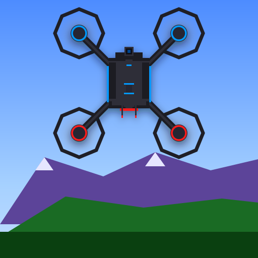
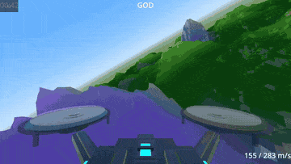
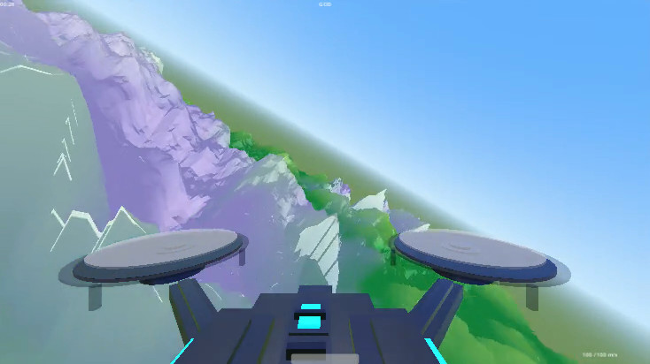
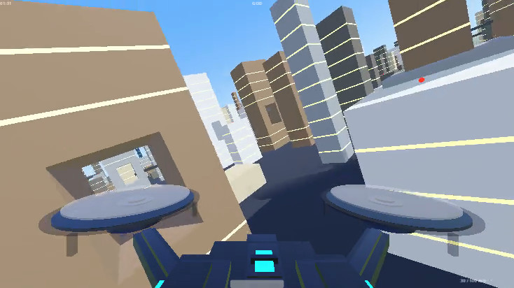
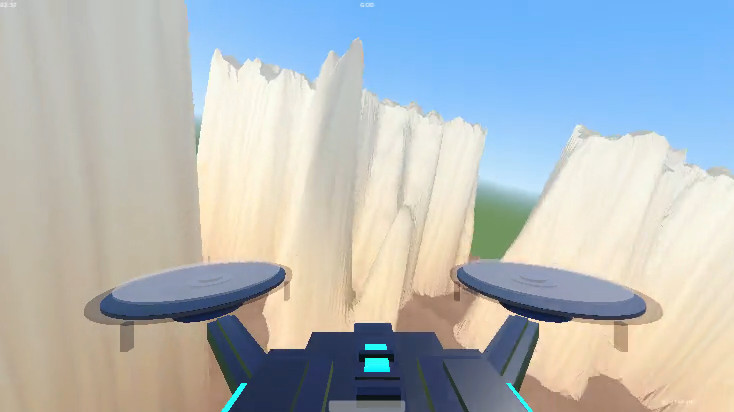
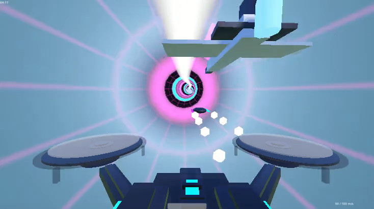

# vfpv



Keyboard-only drone FPV low-altitude high-speed flight experience built with Godot Engine 4.



**[Play in browser on itch.io](https://patakuti.itch.io/vfpv)**

## Screenshots

<table>
  <tr>
    <td></td>
    <td></td>
  </tr>
  <tr>
    <td></td>
    <td></td>
  </tr>
</table>

## Motivation

Drone FPV footage looks fun. This project tries to capture something like that feeling with just `h`, `j`, `k`, `l` — familiar keys for vi users. `:god` and `:auto` make it even easier; combine both and it practically flies itself.

## Requirements

- Godot Engine 4.4+
- Linux, Windows, or Web browser
- Android 10+ (API 30+) — see [ANDROID.md](ANDROID.md)

## How to Run

### Linux

```bash
chmod +x vfpv.x86_64
./vfpv.x86_64
```

### Windows

Run `vfpv.exe`.

### Web

Open `index.html` via a local HTTP server:

```bash
cd Web && python3 -m http.server 8000
```

Then open `http://localhost:8000` in your browser.

### Android

Download `vfpv-android.apk` from the [Releases](../../releases) page, or see [ANDROID.md](ANDROID.md) to build it yourself.

## Controls

### Normal Mode

| Key | Action |
|---|---|
| `h` / `l` | Yaw left / right |
| `H` / `L` | Sharp yaw left / right (2.5x) |
| `j` / `k` | Pitch down / up |
| `J` / `K` | Sharp pitch down / up (3x) |
| `Space` | Boost (consumes fuel, auto-recovers) |
| `p` | Pause / unpause |
| `<digits>g` | Set speed (e.g. `100g` = 100 m/s) |
| `gg` | Set max speed |
| `G` (Shift+g) | Set min speed |
| `.` | Repeat last action for 1 second |
| `:` | Enter command mode |

### Command Mode

| Command | Action |
|---|---|
| `:speed <n>` | Set base speed (20-400) |
| `:reset` | Respawn at start position |
| `:auto` | Toggle auto-avoidance mode |
| `:god` | Toggle god mode (bounce on collision) |
| `:fpv` | Switch to FPV camera |
| `:follow` | Switch to follow camera |
| `:stage terrain` | Switch to natural terrain stage |
| `:stage city` | Switch to urban city stage |
| `:stage canyon` | Switch to canyon stage |
| `:stage tube` | Switch to tube tunnel stage |
| `:stage fuji` | Switch to real-world Mt. Fuji stage (downloads GSI elevation data) |
| `:stage miyajima` | Switch to real-world Miyajima stage (Itsukushima Shrine Otorii, astronomically accurate sunset lighting) |
| `:stage goldengate` | Switch to real-world Golden Gate Bridge stage (downloads AWS Terrain Tiles elevation data) |
| `:stage test_sydney` | Switch to real-world Sydney Harbour Bridge stage (downloads AWS Terrain Tiles elevation data) — experimental; terrain fidelity is on hold, see below |
| `:stage towerbridge` | Switch to real-world Tower Bridge stage (downloads AWS Terrain Tiles elevation data) |
| `:quality low/mid/high/auto` | Set rendering quality (default: auto) |
| `:audio music` | BGM music |
| `:audio drone` | Drone propeller sound (pitch linked to motor output) |
| `:audio off` | Mute all sound |
| `:quit` or `:q` | Quit game |
| `Escape` | Cancel and return to normal mode |

## Features

- **Vi-style controls** — Navigate with familiar vim keybindings
- **Stage selection** — `:stage terrain` for natural terrain, `:stage city` for urban flying, `:stage canyon` for towering rock walls, `:stage tube` for enclosed tunnel racing, `:stage fuji`/`:stage miyajima`/`:stage goldengate`/`:stage test_sydney`/`:stage towerbridge` for real-world terrain
- **Real-world terrain stage** — Live-downloads elevation data for Mt. Fuji, Miyajima, the Golden Gate Bridge, (experimentally) Sydney Harbour, and Tower Bridge, and builds a real terrain patch to fly around (requires network access). Fuji, Miyajima, Golden Gate, and Tower Bridge are available on all platforms, including Android (via the Settings screen's Stage option, or `:stage` on Desktop/Web); the experimental Sydney Harbour stage (`:stage test_sydney`) remains Desktop/Web-only via the command console while its terrain fidelity is on hold. Japanese locations use Japan's Geospatial Information Authority (GSI); the overseas locations use AWS Terrain Tiles, since GSI only covers Japan
  - Real terrain shading: slope- and local-relief-based shading (from the actual downloaded elevation data) so gentle real-world mountains read clearly instead of looking flat
  - Miyajima stage: adds a to-scale Itsukushima Shrine Otorii (built from primitives, positioned from real-world coordinates) and points the sun at its real astronomical position for today's sunset at that location
  - Golden Gate Bridge stage: adds a to-scale bridge (towers, main cables on a real parabola, suspenders, deck — all built from primitives at real-world coordinates/dimensions where published) with an open lattice tower structure to fly through
  - Sydney Harbour Bridge stage (`:stage test_sydney`, **experimental/on hold**): adds a to-scale steel arch bridge (arch, deck, hangers, and four granite pylons, built from primitives at real-world coordinates/dimensions) to fly through, plus the Sydney Opera House (shells approximated as sections of the real 75.2m-radius sphere the actual roof is cut from, per Utzon/Arup's "Spherical Solution"). The surrounding harbour terrain's fidelity against the real coastline has not been validated closely enough yet, so this stage is kept under the `test_sydney` name until that's addressed
  - Tower Bridge stage: adds a to-scale bascule bridge (twin gatehouse towers — a stone cuboid body on a wide pier plinth that follows the real elevation data down to the lowest ground within its footprint, a pyramidal roof, four full-height cylindrical corner turrets with conical caps, solid stone walls on the two side faces, and a modest, road-scaled roadway opening with a real smooth semicircular arch top (a custom curved mesh, not a boxy approximation) hollowed through the base of the two front/back faces with solid wall filling the rest of the way up — plus a low-level road deck, two high-level walkways connecting the tower tops, and suspension chains/hangers on both side spans, all in the steel-blue paint scheme matched to a reference photo — all built from primitives at real-world coordinates/dimensions where published) over the Thames, with the flyable opening being the gap between the low deck and each tower's own roadway archway rather than open sky above a single deck
  - Water reflection: the sea (wherever the elevation tiles have no data, or — for AWS-sourced data — below a sea-level threshold, tuned per location since not every source carries real bathymetry) is a real-time planar reflection — a mirror camera renders the scene and composites it onto the water surface, so the aircraft, terrain, and sky all reflect
  - Water-proximity cues: the low-altitude particle effect switches to white spray over water (color/spread only — intensity is altitude-based, matching the existing dust behavior), and a rotor-downwash ripple (one interfering wave per rotor, at their real positions) appears on the water directly under the aircraft, strengthening as altitude drops
- **Procedural terrain** — Infinite Perlin noise terrain with 3 biomes (canyon, mountain, plains)
- **City stage** — Dense urban grid with buildings 15–100m tall, tight 8–15m street gaps
- **Canyon stage** — Sharp ridged rock walls rising up to ~170m, red-brown to sandy palette, 30–60m valley gaps
- **Tube stage** — Infinite enclosed circular tunnel (diameter 40m) with coaster-style curves; colored ring markers and white spine line make curvature readable; up to 5 rival aircraft fly ahead slightly slower than the player
- **Dynamic chunk loading** — Terrain generates/destroys around player position
- **Speed-linked FOV** — Field of view widens with speed (80° - 110°)
- **Motion blur** — Radial blur intensifies with speed
- **Chromatic aberration** — RGB channel split at high speed
- **Low altitude particles** — Parabolic debris particles when flying low and fast
- **Bank** — Camera/drone tilts during turns; deeper bank on sharp turns
- **Crash effects** — Screen flash + camera shake + crash sound on terrain collision
- **Auto mode** — `:auto` toggles automatic obstacle avoidance (raycast-based, last-moment, lateral preferred)
- **God mode** — `:god` toggles invincibility (bounce off terrain instead of crashing)
- **Racing drone model** — X-frame drone with spinning propellers and neon LED accents
- **FPV overlay** — Drone frame silhouette visible in FPV view
- **BGM** — Looping synthwave track with seamless crossfade
- **Pause** — `p` to pause, auto-pause in command mode
- **Boost system** — Temporary 1.5x speed with fuel gauge and engine sound
- **Hyperspeed effects** — Speed lines, drone glow, and music pitch up when boosting over 200 m/s
- **Procedural SFX** — Crash noise and boost engine sweep (generated at runtime)
- **Quality settings** — `:quality low/mid/high/auto` adjusts render distance and mesh resolution; auto mode adapts to FPS
- **HUD** — Speed, time, boost gauge, quality level, command line

## Project Structure

```
project.godot
scenes/
  main.tscn            # Main scene
  pause_menu.tscn      # Android pause menu
  settings_screen.tscn # Android settings screen
scripts/
  main.gd              # Scene initialization
  player.gd            # Flight physics, boost, crash/respawn
  vi_input.gd          # Vi-style input handling (desktop)
  android_input.gd     # Accelerometer + touch input (Android)
  altitude_slider.gd   # Floating altitude slider overlay (Android)
  settings_manager.gd  # Persistent settings via ConfigFile (Android)
  terrain_manager.gd   # Procedural terrain chunk management
  city_manager.gd      # Urban city stage chunk management
  canyon_manager.gd    # Canyon stage chunk management
  tube_manager.gd      # Tube stage: procedural tunnel + rival aircraft
  hud.gd               # HUD display
  pause_menu.gd        # Android pause menu logic
  settings_screen.gd   # Android settings screen logic
  auto_pilot.gd        # Raycast-based obstacle auto-avoidance
  post_process.gd      # Shader uniform management, crash FX, hyperspeed effects
  sfx.gd               # Procedural sound effects (crash, boost, wind)
  low_altitude_particles.gd  # Speed/altitude-linked particles
music/
  bgm.ogg              # BGM: "Future Travel" by Zodik (CC-BY 3.0)
shaders/
  motion_blur.gdshader
  chromatic_aberration.gdshader
  speed_lines.gdshader
```

## Known Issues

- **Web (Compatibility renderer): Shadows disabled** — Due to a Godot engine bug ([godotengine/godot#90259](https://github.com/godotengine/godot/issues/90259)), shadowed lights cause surfaces to appear overbright/white on the Compatibility renderer (WebGL). Shadows are automatically disabled when running on this renderer.
- **Web: BGM does not play until first user input** — Browser autoplay policy blocks audio until a user interaction (key press, click, etc.). BGM will start automatically after the first input.
- **Web: BGM loop restarts from the beginning** — The `loop_offset` setting is not supported on the Web backend. On desktop, BGM loops seamlessly from a mid-point; on Web, it restarts from the beginning.

## About this project

This tool was designed and implemented entirely by Claude. The human provided the idea. However, this isn't a one-shot output; the human shaped it through hands-on testing and iterative, detail-oriented feedback.

## Credits

- Music: "Future Travel" by Zodik ([CC-BY 3.0](https://creativecommons.org/licenses/by/3.0/)) — https://opengameart.org/content/zodik-future-travel
- Elevation data (Mt. Fuji, Miyajima): [国土地理院](https://www.gsi.go.jp/) (Geospatial Information Authority of Japan), 標高タイル（基盤地図情報数値標高モデル）
- Elevation data (Golden Gate Bridge): [AWS Terrain Tiles](https://registry.opendata.aws/terrain-tiles/) (Terrarium format), sourced from 3DEP data courtesy of the U.S. Geological Survey
- Elevation data (Sydney Harbour): [AWS Terrain Tiles](https://registry.opendata.aws/terrain-tiles/) (Terrarium format), sourced from SRTM and GMTED2010 data courtesy of the U.S. Geological Survey
- Elevation data (Tower Bridge): [AWS Terrain Tiles](https://registry.opendata.aws/terrain-tiles/) (Terrarium format), sourced from UK LIDAR composite DTM data
- Otorii location, Golden Gate Bridge tower positions, Sydney Harbour Bridge/Opera House positions, Tower Bridge tower positions: © [OpenStreetMap](https://www.openstreetmap.org/copyright) contributors ([ODbL](https://opendatacommons.org/licenses/odbl/))
- Golden Gate Bridge dimensions: [Golden Gate Bridge Highway and Transportation District](https://www.goldengate.org/bridge/history-research/statistics-data/design-construction-stats/)
- Sydney Harbour Bridge dimensions: Wikipedia, [BridgeClimb](https://www.bridgeclimb.com/explore/the-bridge), Britannica (cross-checked)
- Sydney Opera House dimensions and "Spherical Solution" shell geometry: [Sydney Opera House](https://www.sydneyoperahouse.com/our-story/the-spherical-solution), Wikipedia
- Tower Bridge dimensions: Wikipedia (cross-checked against multiple secondary sources; the low-level deck clearance figure is Wikipedia-only, not independently corroborated)
