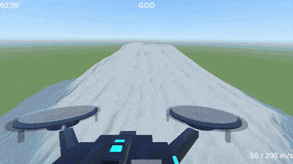
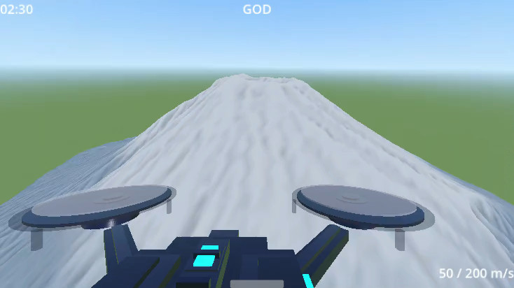
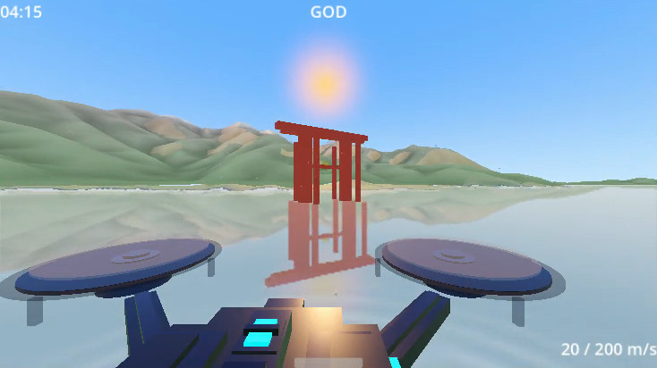
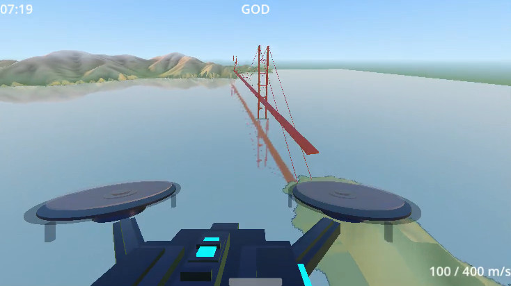
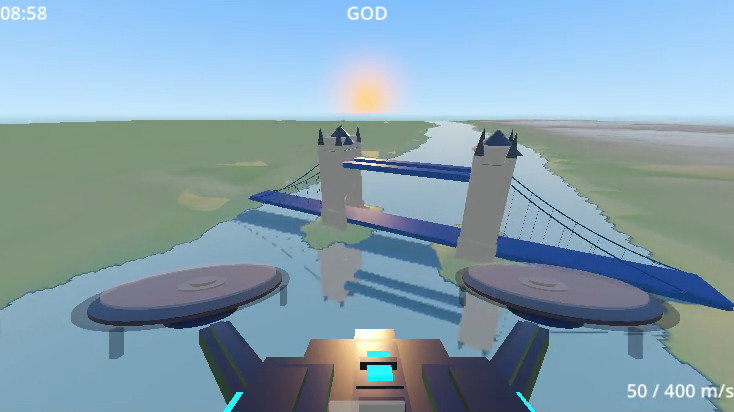

# vfpv


Drone FPV low-altitude high-speed flight experience built with Godot Engine 4. Playable on PC (keyboard, vi-style), in a web browser, and on Android (tilt & touch).

<p>
  
  
</p>

**[Play in browser on itch.io](https://patakuti.itch.io/vfpv)**

## Screenshots

<table>
  <tr>
    <td></td>
    <td></td>
  </tr>
  <tr>
    <td></td>
    <td></td>
  </tr>
</table>

https://github.com/user-attachments/assets/a54a5120-c1d1-4f38-bcaa-00fb4acdf352

### Real World Stages

<table>
  <tr>
    <td></td>
    <td></td>
  </tr>
  <tr>
    <td></td>
    <td></td>
  </tr>
</table>

https://github.com/user-attachments/assets/dbc71a8b-5d0c-4e7d-93e5-cee1c9130875

## Motivation

Drone FPV footage looks fun. The original concept: **get a taste of that thrill on a PC with nothing but vi-like key operation** — just `h`, `j`, `k`, `l`, familiar keys for vi users. `:god` and `:auto` make it even easier; combine both and it practically flies itself.

The Android version deliberately changes that concept: instead of vi keys, it is built to be **intuitive to fly by tilting and dragging**, with no commands to learn.

## PC vs Android

| | PC (Linux / Windows / Web) | Android |
|---|---|---|
| Concept | Enjoy the thrill with vi-like keys | Intuitive, no learning needed |
| Feel | Like an **RC airplane** | Like a **drone controller** |
| Steering | Point the aircraft up/down (`j`/`k`) and left/right (`h`/`l`) to change direction | Tilt the device left/right to steer |
| Speed | Set by command (`100g`, `gg`, `G`, `:speed`) — a bit cumbersome | Tilt the device forward/back |
| Altitude | Pitch the aircraft up/down | Drag on the screen (up = ascend, down = descend) |

See [ANDROID.md](ANDROID.md) for the Android version.

## Requirements

To play:

- Linux, Windows, or a Web browser
- Android 10+ (API 30+) — download the APK from [Releases](../../releases), see [ANDROID.md](ANDROID.md)

To build / run from source:

- Godot Engine 4.4+

## How to Run

### Linux

```bash
chmod +x vfpv.x86_64
./vfpv.x86_64
```

### Windows

Run `vfpv.exe`.

### Web

Open `index.html` via a local HTTP server:

```bash
cd Web && python3 -m http.server 8000
```

Then open `http://localhost:8000` in your browser.

### Android

Download `vfpv-android.apk` from the [Releases](../../releases) page and install it. See [ANDROID.md](ANDROID.md) for the steps and Android-specific controls.

## Controls (PC / Web)

The Android controls (tilt & touch) are described in [ANDROID.md](ANDROID.md).

### Normal Mode

| Key | Action |
|---|---|
| `h` / `l` | Yaw left / right |
| `H` / `L` | Sharp yaw left / right (2.5x) |
| `j` / `k` | Pitch down / up |
| `J` / `K` | Sharp pitch down / up (3x) |
| `Space` | Boost (consumes fuel, auto-recovers) |
| `p` | Pause / unpause |
| `<digits>g` | Set speed (e.g. `100g` = 100 m/s) |
| `gg` | Set max speed |
| `G` (Shift+g) | Set min speed |
| `.` | Repeat last action for 1 second |
| `:` | Enter command mode |

### Command Mode

| Command | Action |
|---|---|
| `:speed <n>` | Set base speed (5-400) |
| `:reset` | Respawn at start position |
| `:auto` | Toggle auto-avoidance mode |
| `:god` | Toggle god mode (bounce on collision) |
| `:fpv` | Switch to FPV camera |
| `:follow` | Switch to follow camera |
| `:stage terrain` | Switch to natural terrain stage |
| `:stage city` | Switch to urban city stage |
| `:stage canyon` | Switch to canyon stage |
| `:stage tube` | Switch to tube tunnel stage |
| `:stage fuji` | Switch to real-world Mt. Fuji stage (downloads GSI elevation data) |
| `:stage miyajima` | Switch to real-world Miyajima stage (Itsukushima Shrine Otorii, astronomically accurate sunset lighting) |
| `:stage goldengate` | Switch to real-world Golden Gate Bridge stage (downloads AWS Terrain Tiles elevation data) |
| `:stage towerbridge` | Switch to real-world Tower Bridge stage (downloads AWS Terrain Tiles elevation data) |
| `:quality low/mid/high/auto` | Set rendering quality (default: auto) |
| `:audio music` | BGM music |
| `:audio drone` | Drone propeller sound (pitch linked to motor output) |
| `:audio off` | Mute all sound |
| `:quit` or `:q` | Quit game |
| `Escape` | Cancel and return to normal mode |

## Features

### Stages

Switch with `:stage <name>` on PC / Web, or from the Settings screen on Android.

- **Terrain** — Infinite Perlin noise terrain with 3 biomes (canyon, mountain, plains), loaded/unloaded dynamically around the player
- **City** — Dense urban grid with buildings 15–100m tall, tight 8–15m street gaps
- **Canyon** — Sharp ridged rock walls rising up to ~170m, red-brown to sandy palette, 30–60m valley gaps
- **Tube** — Infinite enclosed circular tunnel (diameter 40m) with coaster-style curves; colored ring markers and white spine line make curvature readable; up to 5 rival aircraft fly ahead slightly slower than the player
- **Real-world stages** (`fuji` / `miyajima` / `goldengate` / `towerbridge`) — Download real elevation data at runtime (network required) and build the terrain to fly around. Data: GSI for Japan, AWS Terrain Tiles overseas.
  - Landmarks: a to-scale Itsukushima Shrine Otorii (Miyajima), Golden Gate Bridge and Tower Bridge, built from primitives at real-world coordinates/dimensions
  - Lighting: the sun is placed at a real astronomical position for the location (Miyajima: winter-solstice sunset; others: equinox, just before sunset)
  - Water: real-time planar reflection, white spray and rotor ripples when flying low over water
  - Terrain shading based on slope and local relief, so gentle mountains read clearly

### Common (all platforms)

- **Speed-linked effects** — FOV widens with speed (80°–110°), radial motion blur, chromatic aberration at high speed
- **Low altitude particles** — Parabolic debris (dust, or spray over water) when flying low and fast
- **Bank** — Camera/drone tilts during turns; deeper bank on sharp turns
- **Crash effects** — Screen flash + camera shake + crash sound on terrain collision
- **God mode** — Invincibility (bounce off terrain instead of crashing)
- **Racing drone model** — X-frame drone with spinning propellers and neon LED accents; FPV view with drone frame silhouette, or follow camera
- **Audio** — Looping synthwave BGM with seamless crossfade, drone propeller sound, procedural crash SFX (generated at runtime)
- **Quality settings** — Adjusts render distance and mesh resolution; auto mode adapts to FPS
- **HUD** — Speed, time, quality level

### PC / Web only

- **Vi-style controls** — Navigate with familiar vim keybindings, plus a `:` command line
- **Auto mode** — `:auto` toggles automatic obstacle avoidance (raycast-based, last-moment, lateral preferred)
- **Boost system** — Temporary 1.5x speed with fuel gauge and engine sound
- **Hyperspeed effects** — Speed lines, drone glow, and music pitch up when boosting over 200 m/s

## Project Structure

```
project.godot
scenes/
  main.tscn            # Main scene
  pause_menu.tscn      # Android pause menu
  settings_screen.tscn # Android settings screen
scripts/
  main.gd              # Scene initialization, stage switching, sunset lighting
  player.gd            # Flight physics, boost, crash/respawn
  vi_input.gd          # Vi-style input handling (desktop)
  android_input.gd     # Accelerometer + touch input (Android)
  altitude_slider.gd   # Floating altitude slider overlay (Android)
  settings_manager.gd  # Persistent settings via ConfigFile (Android)
  terrain_manager.gd   # Procedural terrain chunk management
  city_manager.gd      # Urban city stage chunk management
  canyon_manager.gd    # Canyon stage chunk management
  tube_manager.gd      # Tube stage: procedural tunnel + rival aircraft
  real_terrain_manager.gd  # Real-world stages: elevation download, terrain, landmarks, water
  solar_position.gd    # Sun position calculation (NOAA formulas)
  hud.gd               # HUD display
  pause_menu.gd        # Android pause menu logic
  settings_screen.gd   # Android settings screen logic
  auto_pilot.gd        # Raycast-based obstacle auto-avoidance
  post_process.gd      # Shader uniform management, crash FX, hyperspeed effects
  sfx.gd               # Procedural sound effects (crash, boost, wind)
  low_altitude_particles.gd  # Speed/altitude-linked particles
music/
  bgm.ogg              # BGM: "Future Travel" by Zodik (CC-BY 3.0)
shaders/
  motion_blur.gdshader
  chromatic_aberration.gdshader
  speed_lines.gdshader
  rival_trail.gdshader
  tube_wall.gdshader
  water_reflection.gdshader
```

## Known Issues

- **Web (Compatibility renderer): Shadows disabled** — Due to a Godot engine bug ([godotengine/godot#90259](https://github.com/godotengine/godot/issues/90259)), shadowed lights cause surfaces to appear overbright/white on the Compatibility renderer (WebGL). Shadows are automatically disabled when running on this renderer.
- **Web: BGM does not play until first user input** — Browser autoplay policy blocks audio until a user interaction (key press, click, etc.). BGM will start automatically after the first input.
- **Web: BGM loop restarts from the beginning** — The `loop_offset` setting is not supported on the Web backend. On desktop, BGM loops seamlessly from a mid-point; on Web, it restarts from the beginning.

## About this project

This tool was designed and implemented entirely by Claude. The human provided the idea. However, this isn't a one-shot output; the human shaped it through hands-on testing and iterative, detail-oriented feedback.

## Credits

- Music: "Future Travel" by Zodik ([CC-BY 3.0](https://creativecommons.org/licenses/by/3.0/)) — https://opengameart.org/content/zodik-future-travel
- Elevation data (Mt. Fuji, Miyajima): [国土地理院](https://www.gsi.go.jp/) (Geospatial Information Authority of Japan), 標高タイル（基盤地図情報数値標高モデル）
- Elevation data (Golden Gate Bridge): [AWS Terrain Tiles](https://registry.opendata.aws/terrain-tiles/) (Terrarium format), sourced from 3DEP data courtesy of the U.S. Geological Survey
- Elevation data (Tower Bridge): [AWS Terrain Tiles](https://registry.opendata.aws/terrain-tiles/) (Terrarium format), sourced from UK LIDAR composite DTM data
- Otorii location, Golden Gate Bridge tower positions, Tower Bridge tower positions: © [OpenStreetMap](https://www.openstreetmap.org/copyright) contributors ([ODbL](https://opendatacommons.org/licenses/odbl/))
- Golden Gate Bridge dimensions: [Golden Gate Bridge Highway and Transportation District](https://www.goldengate.org/bridge/history-research/statistics-data/design-construction-stats/)
- Tower Bridge dimensions: Wikipedia (cross-checked against multiple secondary sources; the low-level deck clearance figure is Wikipedia-only, not independently corroborated)
